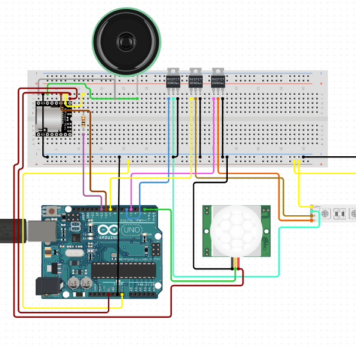

# Overview

This is a game for kids that plays music, randomly stops it, and watches for motion. If anyone moves, they lose. 
Pre-load your kids' favourite songs as MP3s into the SD card that goes into the DFPlayer module. 
I packaged it all up into a custom plexiglass enclosure with an included battery power supply, with some buttons and switches on the outside for power-on/off and continuing to play.

# Wiring

# Parts List

* Arduino Uno
* DFPlayer Mini with SD card
* PIR motion sensor
* Programmable RGB LED Strip
* Batteries

# Notes
Based on http://www.electronics-lab.com/project/mp3-player-using-arduino-dfplayer-mini/

